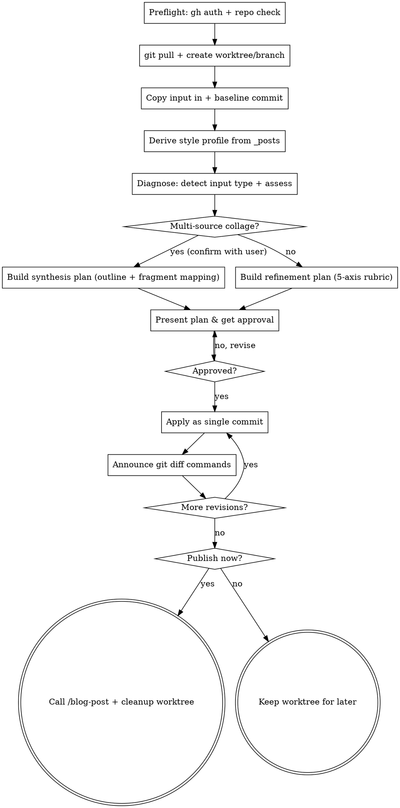

# blog-draft Skill Implementation Plan

> **For agentic workers:** REQUIRED SUB-SKILL: Use superpowers:subagent-driven-development (recommended) or superpowers:executing-plans to implement this plan task-by-task. Steps use checkbox (`- [ ]`) syntax for tracking.

**Goal:** `/blog-draft` 스킬을 신설해, 거친 마크다운 초안(또는 여러 출처를 한 파일에 모아 붙여 넣은 콜라주)을 기존 블로그와 동질감 있고 논리적으로 탄탄한 완성본으로 다듬어 `/blog-post`에 넘긴다.

**Architecture:** 단일 `SKILL.md` 파일로 작성한다(기존 `blog-post` 스킬의 단일 파일 구조를 그대로 따름). `claude-config` repo의 `skills/blog-draft/`에 두고 `~/.claude/skills/`에 심볼릭 링크한다. 실행 코드가 아닌 마크다운 지시 문서이므로 단위 테스트는 없고, 검증은 스펙 대조 + 행동 기반 dry-run으로 한다.

**Tech Stack:** Markdown (Claude Code Skill 포맷), git worktree, `gh` CLI, bash. superpowers `writing-skills`로 작성하고, `using-git-worktrees`를 런타임 의존으로 참조한다.

**Spec:** `docs/superpowers/specs/2026-05-22-blog-draft-skill-design.md`

**커밋 규칙:** 모든 커밋은 `claude-config` repo의 `feat/blog-draft-skill` 브랜치에서 한다. 모든 커밋 메시지 끝에 다음 트레일러를 붙인다:

```
Co-Authored-By: Claude Opus 4.7 (1M context) <noreply@anthropic.com>
```

---

## File Structure

- **Create:** `/Users/randy/dev/claude-config/skills/blog-draft/SKILL.md` — 스킬 전체 (단일 파일)
- **Create:** `~/.claude/skills/blog-draft` — 위 디렉터리로의 심볼릭 링크 (repo 밖, 커밋 대상 아님)
- **Reference only (수정 금지):** `/Users/randy/dev/claude-config/skills/blog-post/SKILL.md` — 포맷·말투 레퍼런스

단일 파일 결정 근거: `blog-post` 스킬이 `SKILL.md` 하나로 구성돼 있고, 스펙 분량이 별도 reference 파일로 쪼갤 만큼 크지 않다. 동일 패턴을 유지한다.

---

## Task 0: 작업 브랜치 + 기획 문서 커밋

`claude-config` repo는 `main` 위에 있다. CLAUDE.md의 GitHub Flow에 따라 feature 브랜치를 먼저 만든다. 무관한 변경(`statusline-command.sh`)은 건드리지 않는다.

**Files:**
- Commit: `docs/superpowers/specs/2026-05-22-blog-draft-skill-design.md` (작성 완료, 미커밋 상태)
- Commit: `docs/superpowers/plans/2026-05-22-blog-draft-skill.md` (이 문서)

- [ ] **Step 1: 브랜치 생성**

```bash
cd /Users/randy/dev/claude-config
git checkout -b feat/blog-draft-skill
```

- [ ] **Step 2: 기획 문서만 스테이징**

```bash
git add docs/superpowers/specs/2026-05-22-blog-draft-skill-design.md \
        docs/superpowers/plans/2026-05-22-blog-draft-skill.md
```

`git status`로 `statusline-command.sh`가 스테이징되지 않았는지 확인한다.

- [ ] **Step 3: Commit**

```bash
git commit -m "$(cat <<'EOF'
docs(blog-draft): add design spec and implementation plan

Co-Authored-By: Claude Opus 4.7 (1M context) <noreply@anthropic.com>
EOF
)"
```

---

## Task 1: SKILL.md 작성

이 태스크는 `superpowers:writing-skills` 스킬을 사용해 수행한다. 내용 출처는 스펙 문서다.

**Files:**
- Create: `/Users/randy/dev/claude-config/skills/blog-draft/SKILL.md`

- [ ] **Step 1: 레퍼런스 정독**

다음 두 파일을 Read 한다:
- `/Users/randy/dev/claude-config/skills/blog-post/SKILL.md` — 포맷, 말투, dot graph 스타일, 섹션 구성
- `/Users/randy/dev/claude-config/docs/superpowers/specs/2026-05-22-blog-draft-skill-design.md` — 내용 출처

- [ ] **Step 2: 스킬 디렉터리 생성**

```bash
mkdir -p /Users/randy/dev/claude-config/skills/blog-draft
```

- [ ] **Step 3: SKILL.md frontmatter 작성**

파일 맨 위에 아래 frontmatter를 정확히 넣는다:

```markdown
---
name: blog-draft
description: Use when the user wants to refine a rough markdown draft into a polished blog post matching the existing blog's tone before publishing, or explicitly invokes /blog-draft with a draft file path
---
```

- [ ] **Step 4: Workflow dot graph 작성**

`## Workflow` 섹션에 아래 dot graph를 넣는다 (스펙 6장 10단계를 노드로 표현):



- [ ] **Step 5: 본문 섹션 작성**

스펙 내용을 아래 섹션 구조로 옮긴다. 각 섹션의 상세 내용은 스펙 문서의 해당 장을 그대로 반영한다:

| SKILL.md 섹션 | 스펙 출처 | 내용 요지 |
|---|---|---|
| `# Blog Draft Skill` + Overview | 1·2·3장 | 배경, 목표/비목표, blog-draft↔blog-post 역할 분담 |
| `## Input` | 4장 | `/blog-draft <rough-draft-md-path>` |
| `## Workflow` | 6장 | Step 4의 dot graph + 10단계 설명 |
| `## Multi-Source Synthesis` | 11장 | 콜라주 감지 분기 → 통합 구조안 생성, 워크플로 통합(콜라주는 1라운드=통합) |
| `## Workspace` | 5장 | git worktree + 스크래치 브랜치 `draft/<slug>`, `git pull` 선행, 발행 후 정리/미발행 시 유지 |
| `## Diagnosis Rubric` | 7장 | 5축(A 톤·매너 동질감, B 논리, C 문장·표현, D 부족한 부분, E 교차참조). A·B가 우선 축 |
| `## Diagnosis Report Format` | 8장 | A축 대조표, B~E축 `위치→문제→제안` |
| `## Gap Handling Policy` | 9장 | 플래그+제안, 무단 사실 생성 금지, 필요 사실 부재 시 사용자에게 질문 |
| `## blog-post Handoff` | 4·6장 | 마무리에 "발행할까요?" 확인 → 승인 시 최종 md 경로로 `/blog-post` 호출 |
| `## Error Handling` | 10장 | 엣지 케이스 표 |

주의 사항:
- `## Workflow` 10단계 설명에 baseline SHA 기록, 한 라운드 = 한 커밋, diff 안내 명령(`git diff --word-diff HEAD~1 HEAD`, baseline 대비 누적)을 명시한다.
- `## Workspace`에 worktree 생성은 `superpowers:using-git-worktrees` 스킬을 쓴다고 명시한다.
- `## Diagnosis Rubric`의 A축 측정자는 4단계에서 매 실행마다 새로 도출하는 스타일 프로파일임을 명시한다.
- `## Workflow` 5단계 설명과 dot graph에 콜라주 감지 분기를 반드시 포함한다. 단일 초안과 콜라주 입력이 같은 진단·승인·적용·반복 루프를 타되, 콜라주는 첫 라운드 산출물이 통합 초안임을 명시한다(스펙 11장).

- [ ] **Step 6: Commit**

```bash
cd /Users/randy/dev/claude-config
git add skills/blog-draft/SKILL.md
git commit -m "$(cat <<'EOF'
feat(blog-draft): add blog-draft skill for refining drafts before publishing

Co-Authored-By: Claude Opus 4.7 (1M context) <noreply@anthropic.com>
EOF
)"
```

---

## Task 2: 설치 및 디스커버리 검증

**Files:**
- Create: `~/.claude/skills/blog-draft` (심볼릭 링크)

- [ ] **Step 1: 심볼릭 링크 생성**

```bash
ln -s /Users/randy/dev/claude-config/skills/blog-draft ~/.claude/skills/blog-draft
```

- [ ] **Step 2: 링크 확인**

```bash
ls -la ~/.claude/skills/blog-draft
```

Expected: `~/.claude/skills/blog-draft -> /Users/randy/dev/claude-config/skills/blog-draft`

- [ ] **Step 3: frontmatter 유효성 확인**

```bash
head -4 ~/.claude/skills/blog-draft/SKILL.md
```

Expected: 1행 `---`, `name: blog-draft`, `description:` 한 줄, 닫는 `---`. 기존 `blog-post`의 frontmatter와 동일한 키 구성인지 대조한다.

(심볼릭 링크는 repo 밖이라 커밋 대상이 아니다.)

---

## Task 3: 검증 — 스펙 대조 + 행동 dry-run

- [ ] **Step 1: 스펙 커버리지 대조**

`SKILL.md`를 스펙 문서와 나란히 놓고, 스펙 4~10장의 각 요구사항이 `SKILL.md`에 반영됐는지 확인한다. 누락 항목이 있으면 `SKILL.md`를 수정한다.

확인 체크리스트:
- 입력 계약 `/blog-draft <path>` 명시
- 10단계 워크플로 전부 (preflight ~ 마무리)
- worktree 전략 + `git pull` 선행 + 발행 후 정리/미발행 시 유지
- 5축 루브릭 전부, A·B 우선 명시
- 한 라운드 = 한 커밋, baseline SHA 기록, diff 안내 명령
- 부족한 부분 정책 (무단 사실 생성 금지)
- "발행할까요?" → `/blog-post` 연결
- 엣지 케이스 표 7개 항목
- 통합 모드(스펙 11장): 콜라주 감지 신호·사용자 확인, 통합 구조안 산출 항목, 콜라주는 1라운드=통합/2라운드+=정련

- [ ] **Step 2: 누락·불일치 수정 시 커밋**

수정이 있었다면:

```bash
cd /Users/randy/dev/claude-config
git add skills/blog-draft/SKILL.md
git commit -m "$(cat <<'EOF'
fix(blog-draft): align SKILL.md with design spec

Co-Authored-By: Claude Opus 4.7 (1M context) <noreply@anthropic.com>
EOF
)"
```

- [ ] **Step 3: 행동 dry-run (선택, 신뢰도 확인용)**

새 Claude Code 세션에서(스킬은 세션 시작 시 로드됨) `/blog-draft`를 호출한다. **계획 승인 단계까지만 진행하고 적용·발행 전에 중단**한다. 두 가지 입력으로 각각 확인한다:
- **단일 초안:** preflight → worktree 생성 → baseline 커밋 → 스타일 프로파일 도출 → 진단 리포트 제시 순으로 흐르고, 진단 리포트가 5축(A~E)을 모두 다루는가
- **콜라주:** 여러 출처(블로그 글·AI 대화 발췌·기타 텍스트)를 모아 붙여 넣은 입력에서 콜라주로 감지·확인하고, 진단 리포트 대신 통합 구조안(목차 + 조각 매핑)이 제시되는가
- 어긋나면 `SKILL.md` 수정 후 Step 2처럼 커밋

dry-run으로 생긴 worktree·임시 파일은 정리한다:

```bash
cd /Users/randy/claude_code/thahiti.github.io
git worktree list   # dry-run 워크트리 확인
git worktree remove <dry-run-worktree-path>
git branch -D draft/<slug>
```

---

## Self-Review (계획 작성자 수행 완료)

- **Spec coverage:** 스펙 1~12장 → Task 1 Step 5 매핑 표가 4~11장을 모두 커버(11장 통합 모드 포함). 1~3장(배경·목표·역할)은 Overview로, 12장(추후 고려)은 스킬 본문에 넣지 않음(구현 비대상이라 의도적 제외).
- **Placeholder scan:** `<slug>`, `<path>`, `<dry-run-worktree-path>`는 실행 시점에 채워지는 정상 플레이스홀더. TBD/TODO 없음.
- **Type consistency:** 스킬 문서라 타입·시그니처 없음. 브랜치명(`feat/blog-draft-skill`, `draft/<slug>`), 경로, 섹션명은 Task 간 일관.
