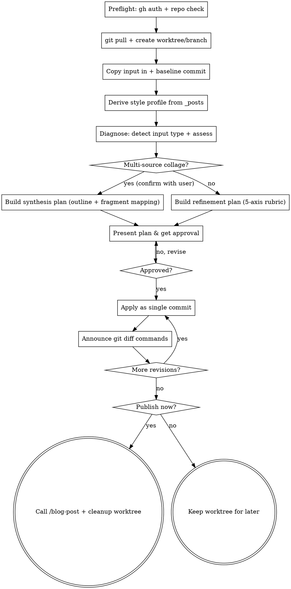

# Blog Draft Skill

## Overview

거친 초안 md 파일을, 기존 블로그 글들과 **동질감** 있고 **논리적으로 탄탄한** 완성본으로 다듬는다. 다듬어진 결과는 `frontmatter`(태그·카테고리·내부 링크)까지 채워져 `/blog-post`가 바로 발행할 수 있는 상태로 산출된다.

기존 `/blog-post` 스킬은 **발행 전용**이다. 로컬 md 파일을 GitHub API로 업로드할 뿐 본문 컨텐츠는 손대지 않는다. `/blog-draft`는 그 빠진 **다듬는 단계**를 채운다.

**역할 분담:**

| 스킬 | 역할 |
|------|------|
| `/blog-draft` | **지능** — 진단·재구성·교정·톤 일치·교차참조. frontmatter까지 채운 완성 md 산출 |
| `/blog-post` | **발행** — 완성된 md를 `gh` API로 업로드 (기존 그대로) |

흐름: `blog-draft` → (검토·반복) → `blog-post`.

**비목표 (스코프 경계):**

- 다이어그램·이미지를 **생성하지 않는다** — "여기 시각자료가 있으면 좋겠다"는 *플래그*만 한다
- `/blog-post`를 수정하지 않는다 — 기존 스킬을 그대로 사용한다
- 외부 글쓰기 루브릭을 적용하지 않는다 — 기준은 **블로그 코퍼스 자체에서 경험적으로 도출**한다

## Input

```
/blog-draft <rough-draft-md-path>
```

- 거친 초안 *또는* 여러 출처를 한 파일에 모아 붙여 넣은 콜라주 md 파일 경로
- 입력 파일은 repo 안/밖 어디에 있어도 무관하다
- **출력:** worktree 안의 `_posts/YYYY-MM-DD-slug.md` — frontmatter가 완성된 최종 md
- **연결:** 발행 승인 시 이 경로를 그대로 `/blog-post`에 전달한다

## Workflow



### 10단계 설명

1. **사전 점검** — `gh` 인증 상태와 현재 위치가 `thahiti.github.io` repo인지 확인한다. 미충족 시 안내 후 종료한다.
2. **워크스페이스 준비** — `git pull`로 `main`을 동기화한 뒤 worktree + 스크래치 브랜치 `draft/<slug>`를 생성한다. 자세한 내용은 `## Workspace` 참조.
3. **원본 안착 + baseline 커밋** — 입력 파일(초안 또는 콜라주)을 worktree의 최종 경로(`_posts/YYYY-MM-DD-slug.md`)로 복사한 뒤 `draft: original` 커밋을 만든다. **이 커밋 SHA를 baseline 기준점으로 기록**한다 — 이후 모든 누적 diff의 비교 대상이다.
4. **스타일 프로파일 도출** — worktree의 기존 `_posts/*.md`를 전수 정독해 블로그의 톤·매너·구성 관습을 스타일 프로파일로 정리한다. 동시에 관련 주제와 기존 태그/카테고리 체계를 파악한다. 이 프로파일이 진단의 측정자(measuring stick)다.
5. **진단** — 먼저 입력이 단일 초안인지 다중 출처 콜라주인지 판별한다(`## Multi-Source Synthesis` 참조). 단일 초안이면 5축 루브릭(`## Diagnosis Rubric`)으로 분석해 진단 리포트(`## Diagnosis Report Format`)를, 콜라주면 통합 구조안을 생성한다.
6. **계획 제시 + 승인** — 진단 리포트(또는 통합 구조안)가 곧 변경 계획이다. 사용자에게 제시하고 승인을 받는다. 수정 요청 시 계획을 조정해 다시 제시한다.
7. **일괄 적용** — 승인된 계획을 적용한다. 콜라주 입력의 첫 라운드는 통합 초안 작성이고, 이후 라운드는 구조 재배치·문장 교정·frontmatter 기입이다. **이번 라운드 전체를 하나의 커밋**으로 생성한다 — 한 리뷰 라운드 = 한 커밋이다.
8. **리뷰 안내** — 적용 직전에 기록해 둔 SHA를 사용해 명시적 diff 명령을 안내한다:
   - 이번 라운드: `git diff --word-diff <라운드 직전 SHA> HEAD`
   - 누적 변경: `git diff --word-diff <baseline SHA> HEAD`
9. **Iteration** — 추가 수정 요청 시: 현재 라운드 직전 SHA를 기록 → 적용 → 단일 커밋 → 8단계로 반복한다. 한 라운드 = 한 커밋이므로 각 라운드의 변경을 커밋 단위로 깔끔하게 되짚을 수 있다.
10. **마무리** — 사용자가 만족하면 "이대로 발행할까요?"로 확인한다. 승인 시 최종 md 경로로 `/blog-post`를 호출하고 worktree·브랜치를 정리한다. 거부 시 worktree를 유지하고 재개 방법을 안내한다.

## Multi-Source Synthesis

입력 파일이 단일한 거친 초안이 아니라, 여러 출처(다른 블로그 글, AI 대화 발췌, 메모, 기타 텍스트)를 한 파일에 모아 붙여 넣은 "콜라주"일 때 적용한다.

**감지 (워크플로 5단계):** 입력을 분석해 다음 신호로 콜라주 여부를 판별한다.

- 한 파일 안에 이질적인 주제·문체·서술 시점이 혼재
- AI 대화 발췌의 흔적 (역할 레이블, 질의응답 형태 등)
- 출처별로 끊기는 맥락, 중복·상충하는 서술
- 명시적 구분선이나 붙여넣기 경계

콜라주로 판단되면 사용자에게 **"다중 출처로 보입니다 — 통합 초안을 생성할까요?"**로 확인한 뒤 진행한다.

**통합 구조안:** 콜라주로 확정되면 5단계 진단의 산출물이 일반 진단 리포트 대신 **통합 구조안**이 된다.

- 전체를 관통하는 핵심 주제·메시지 도출
- 도입→전개→결론의 일관되고 논리적인 목차(아웃라인) 제안
- 각 출처 조각을 어느 섹션에 배치할지 매핑
- 중복 내용 통합, 상충 내용 표시, 본문에서 뺄 조각 표시
- 출처 사이의 빈 논리 연결고리는 "부족한 부분"으로 플래그 (`## Gap Handling Policy` — 무단 사실 생성 금지, 필요 시 사용자에게 질문)

**워크플로 통합:** 통합 모드는 별도 단계를 추가하지 않고 기존 워크플로에 그대로 얹힌다. 단일 초안과 콜라주 입력은 같은 진단·승인·적용·반복 루프를 탄다.

- 3단계 baseline 커밋 = 원본 콜라주 그대로
- 6단계 = 통합 구조안 승인
- 7단계 = 승인된 구조로 통합 초안을 작성해 단일 커밋. `git diff <baseline> HEAD`가 "콜라주 → 정돈된 포스트" 변환 전체를 보여준다
- 8·9단계 = 이후 라운드에서 통상의 5축 교정으로 다듬기 반복

요컨대 **콜라주 입력은 "1라운드 = 통합, 2라운드 이후 = 정련"**, 단일 초안 입력은 "1라운드부터 정련"이다.

## Workspace

- 기존 repo(`thahiti.github.io`) 기반 **git worktree** + 스크래치 브랜치 `draft/<slug>`를 사용한다.
- worktree 생성에는 `superpowers:using-git-worktrees` 스킬을 사용한다.
- worktree 생성 전 `git pull`로 `main`을 동기화한다 — 톤 분석·교차참조가 최신 코퍼스를 보도록 하기 위함이다.
- 별도 fresh clone을 만들지 않는다 (사본 중복·정리 부담 회피).
- worktree/브랜치는 **버려지는 스크래치**다. `/blog-post`가 최종 파일을 API로 발행하므로 `main`에 머지하지 않는다.
  - 발행 완료 시: worktree·브랜치를 정리(삭제)한다.
  - 발행 거부 시: worktree를 유지하고 재개 방법을 안내한다.

## Diagnosis Rubric

기준은 외부 규칙이 아니라 **블로그 코퍼스에서 경험적으로 도출**한다. 워크플로 4단계에서 **매 실행마다 새로 도출하는 스타일 프로파일**이 A축의 측정자다.

**A. 톤·매너 동질감 (핵심 축)** — 스타일 프로파일 대비 평가

- 어미체·경어체
- 문장 길이·리듬·호흡
- 어휘 수준, 전문용어를 풀어 쓰는 방식
- 전개 방식 — 예시·비유 빈도, 도입부·마무리 패턴
- 헤딩·단락·코드블록·표 사용 *관습* (이 블로그가 실제로 하는 방식)
- → 핵심 질문: 초안이 **"같은 블로그의 글"로 읽히는가**

**B. 논리적 탄탄함 (핵심 축)** — 주장–근거 연결, 논리 비약·구멍, 도입→전개→결론 흐름, 내부 모순·용어 불일치

**C. 문장·표현 교정** — 어색한 표현·어미·문법 오류, 가독성

**D. 부족한 부분** — 빈약한 섹션·설명 누락

**E. 교차참조 → frontmatter** — 관련 기존 글 내부 링크, 기존 태그·카테고리 체계와 일치하는 제안

> A·B가 우선 축이다. **동질감과 논리**가 통과 기준이고, C/D/E는 이를 받친다.

## Diagnosis Report Format

- **A축:** `스타일 프로파일 ↔ 초안` 대조표 (항목별 일치/이탈 표시)
- **B~E축:** 항목별 `위치 → 문제 → 제안`
- 이 리포트가 곧 워크플로 6단계의 변경 계획이 된다.

## Gap Handling Policy

부족한 부분(D축) 처리는 CLAUDE.md의 "확실하지 않은 정보는 추측하지 말 것" 원칙을 따른다.

- 약한 부분을 진단 리포트에 표시하고 보강 *방향*을 제안한다.
- 보강에 원문에 없는 **사실**이 필요하면 → 지어내지 않고 **사용자에게 질문**한다.
- 본문 반영은 계획 승인 후에만 한다.

## blog-post Handoff

워크플로 10단계 마무리에서:

- 사용자가 만족하면 **"이대로 발행할까요?"**로 확인한다.
- 승인 시 worktree 안의 최종 md 경로(`_posts/YYYY-MM-DD-slug.md`)를 그대로 `/blog-post`에 전달해 호출한다.
- 발행 완료 후 worktree·브랜치를 정리한다.
- 거부 시 `/blog-post`를 호출하지 않고 worktree를 유지하며 재개 방법을 안내한다.

## Error Handling

| 상황 | 대응 |
|------|------|
| 입력 md 없음 / repo 밖에서 실행 | 안내 후 종료 |
| `gh` 미인증 | `gh auth login` 안내 |
| `git pull` 충돌·실패 | 안내 후 사용자 결정 대기 |
| worktree 생성 실패 | 안내 후 종료 |
| 보강에 필요한 사실 부재 | 지어내지 않고 사용자에게 질문 |
| 발행 거부 | worktree 유지 + 재개 방법 안내 |
| 동일 날짜+slug 포스트 존재 | `/blog-post` 단계에서 덮어쓰기 확인 |
