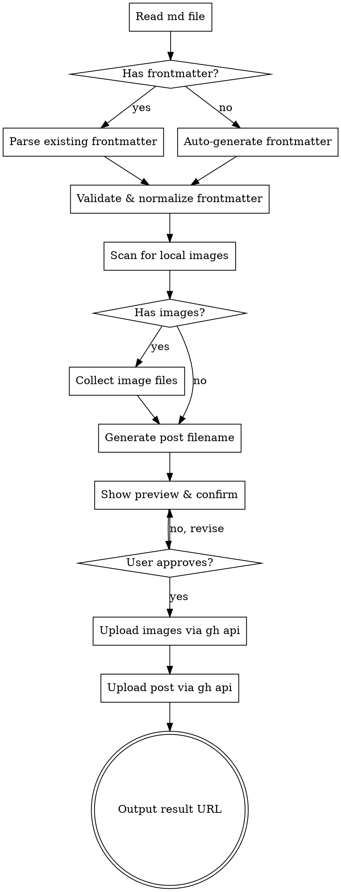

# Blog Post Publishing Skill

## Overview

로컬 md 파일을 Jekyll(Chirpy 테마) 블로그 레포에 GitHub API(`gh`)로 자동 포스팅한다.

**대상 레포:** `thahiti/thahiti.github.io` (GitHub Pages, main 브랜치)

## Input

```
/blog-post <md-file-path>
```

## Workflow



## Step-by-Step

### 1. md 파일 읽기

- 입력된 경로의 md 파일을 Read 도구로 읽는다
- 파일이 존재하지 않으면 에러 메시지 출력 후 종료

### 2. Frontmatter 처리

**이미 있는 경우:** 기존 값을 유지하되 아래 필수 필드가 빠져 있으면 보완한다.

**없는 경우:** 파일명과 내용을 분석하여 자동 생성한다.

#### 필수 frontmatter 필드

```yaml
layout: post
title: "제목"                              # 파일 첫 번째 # 헤딩 또는 파일명에서 추출
date: YYYY-MM-DD HH:MM:SS +0900           # 현재 시각 사용
categories:
  - Category                               # 내용 기반 추론
tags:
  - tag1                                   # 내용 기반 추론
```

#### 선택 frontmatter 필드 (해당 시 추가)

```yaml
media_subpath: /assets/img/posts/{slug}/   # 로컬 이미지가 있을 때만
last_modified_at: YYYY-MM-DD HH:MM:SS +0900
```

#### Frontmatter 자동 생성 규칙

| 필드 | 추출 방법 |
|------|-----------|
| `title` | 첫 번째 `# ` 헤딩. 없으면 파일명에서 추출 |
| `date` | 현재 시각 (Asia/Seoul, +0900) |
| `categories` | 내용 키워드 기반 추론 (1~2개) |
| `tags` | 내용 키워드 기반 추론 (3~5개, 소문자 kebab-case) |

### 3. 이미지 처리

md 본문에서 로컬 이미지 참조를 탐지한다:
- `` 형태의 상대경로
- `` 형태의 상대경로

처리 순서:
1. md 파일 기준 상대경로로 이미지 파일 존재 확인
2. 업로드 대상 경로: `assets/img/posts/{slug}/` 하위
3. frontmatter에 `media_subpath: /assets/img/posts/{slug}/` 추가
4. md 본문의 이미지 경로를 파일명만 남기도록 변환 (media_subpath가 prefix 역할)

### 4. 파일명 생성

`YYYY-MM-DD-{slug}.md` 형식으로 변환한다.

- `YYYY-MM-DD`: frontmatter의 date에서 추출
- `slug`: title을 영문 kebab-case로 변환. 한글이면 적절한 영문 slug 생성

### 5. 사용자 확인

포스팅 전 아래 내용을 보여주고 확인을 받는다:
- 최종 frontmatter
- 파일명 (`_posts/YYYY-MM-DD-slug.md`)
- 업로드할 이미지 목록 (있을 경우)

### 6. GitHub API로 업로드

`gh api` 명령을 사용하여 파일을 생성한다.

#### 이미지 업로드

```bash
# 이미지를 base64로 인코딩하여 업로드
base64 -i <local-image-path> | gh api \
  repos/thahiti/thahiti.github.io/contents/assets/img/posts/{slug}/{filename} \
  --method PUT \
  -f message="Add image: {filename}" \
  -f content=@- \
  -f branch=main
```

#### 포스트 업로드

```bash
# md 파일을 base64로 인코딩하여 업로드
base64 -i <prepared-md-path> | gh api \
  repos/thahiti/thahiti.github.io/contents/_posts/{post-filename} \
  --method PUT \
  -f message="Add post: {title}" \
  -f content=@- \
  -f branch=main
```

**동일 파일명이 이미 존재하는 경우:**
- 기존 파일의 SHA를 먼저 조회
- 사용자에게 덮어쓸지 확인
- 덮어쓸 경우 `-f sha={existing-sha}` 추가하여 업데이트

### 7. 결과 출력

업로드 완료 후:
- 게시글 URL: `https://thahiti.github.io/{slug}/`
- GitHub 파일 URL
- 업로드된 이미지 수

## Error Handling

| 상황 | 대응 |
|------|------|
| md 파일 미존재 | 에러 메시지 출력 후 종료 |
| 이미지 파일 미존재 | 경고 후 해당 이미지 건너뜀 (사용자 확인) |
| `gh` 미인증 | `gh auth login` 실행 안내 |
| 동일 파일명 존재 | 덮어쓸지 사용자 확인 |
| API rate limit | 재시도 안내 |
