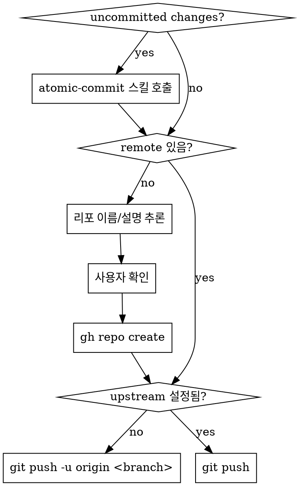

# GitHub Push

GitHub에 push하는 스킬. remote가 없으면 리포를 생성하고, uncommitted changes가 있으면 atomic-commit 스킬로 먼저 커밋한다.

## Prerequisites

- `gh` CLI 인증 완료 (`gh auth status`로 확인)
- git 저장소 초기화 완료

## 플로우



## 1. 사전 커밋

```bash
git status --porcelain
```

출력이 있으면 **atomic-commit 스킬을 호출**하여 변경사항을 커밋한다. 스킬이 원칙(한 커밋 = 한 논리적 변경)에 따라 분리 커밋을 수행하므로 사용자에게 별도로 묻지 않는다. 커밋 완료 후 다음 단계로 진행한다.

## 2. Remote 확인

```bash
git remote -v
```

remote가 있으면 **4. Push**로 건너뛴다.

## 3. GitHub 리포 생성

### 리포 이름/설명 추론

아래 소스를 우선순위 순으로 확인하여 이름과 설명을 추론한다:

| 우선순위 | 소스 | 이름 | 설명 |
|---------|------|------|------|
| 1 | `package.json` | `name` | `description` |
| 2 | `README.md` | H1 제목 | 첫 단락 |
| 3 | `Cargo.toml` | `[package] name` | `description` |
| 4 | `pyproject.toml` | `[project] name` | `description` |
| 5 | 디렉토리 이름 | basename | (없음) |

### 사용자 확인

추론 결과를 보여주고 **반드시** 확인을 받는다:

> GitHub 리포를 생성합니다:
> - 이름: `mdviewer`
> - 설명: `Markdown viewer built with Electron`
> - 공개: public
>
> 진행할까요? (이름/설명 수정 가능)

사용자가 수정을 원하면 반영한다.

### 생성 명령

```bash
gh repo create <name> --public --description "<description>" --source=. --remote=origin
```

`--push` 플래그를 사용하지 않는다. push는 다음 단계에서 별도 실행한다.

## 4. Push

```bash
# upstream 확인
git rev-parse --abbrev-ref --symbolic-full-name @{u} 2>/dev/null
```

- 실패(upstream 없음): `git push -u origin <current-branch>`
- 성공(upstream 있음): `git push`
